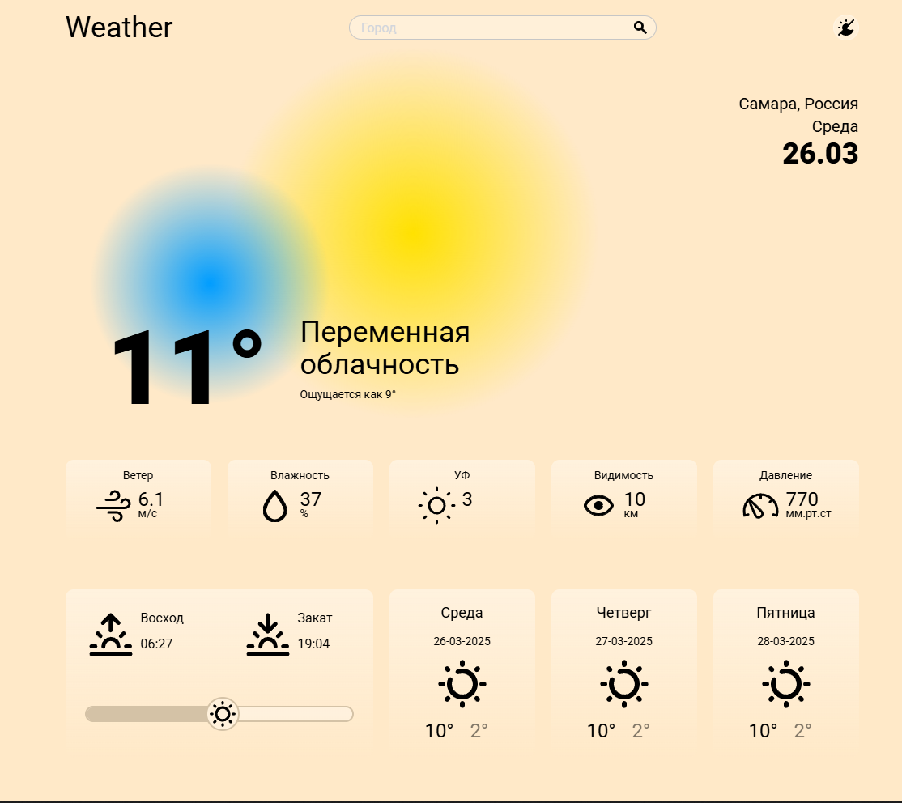
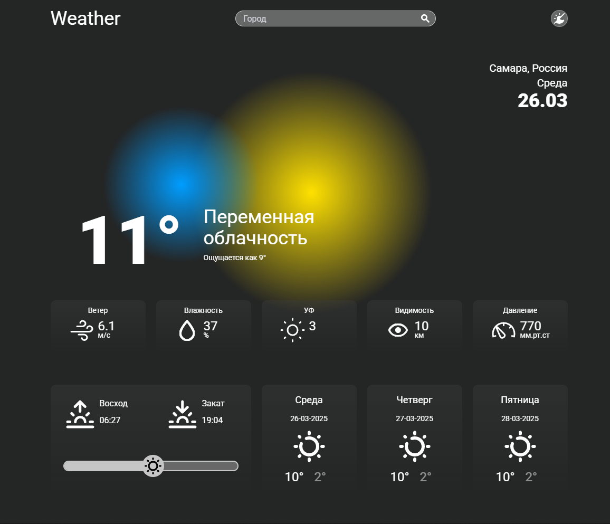
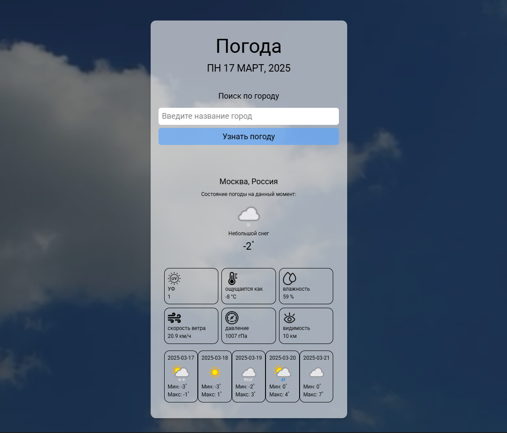

# Приложение "Погода"

**Простое и стильное погодное приложение на React с динамическим интерфейсом**  
Получает данные о погоде в реальном времени и прогноз на 3 дня через WeatherAPI. Сохраняет последний город в localStorage. Интерфейс включает динамические круги, которые меняют цвет в зависимости от погодных условий (например, жёлтый и голубой для солнечной погоды, белый и голубой для облачной погоды) и плавно передвигаются по экрану, создавая эффект живого фона. Есть адаптивная светлая и темная тема.

Это начальная версия проекта, демонстрирующая навыки работы с React, Redux Toolkit, Tailwind.

## Возможности
- **Погода в реальном времени**: отображает текущие погодные условия (*температура, УФ-индекс, влажность, скорость ветра, давление, видимость*) для любого города.
- **Прогноз на 3 дня**: показывает *мин/макс температуры* и иконки погоды на ближайшие дни.
- **Сохранение поиска**: последний введённый город сохраняется в *localStorage* для удобства пользователя.

## Технологии
#### - 🌐 **React**: фреймворк для создания интерфейса.
#### - 🛠️ **Redux Toolkit**: управление состоянием приложения.
#### - 🎨 **Tailwind**: утилитарный CSS-фреймворк для стилизации.
#### - 📡 **Axios**: для запросов к WeatherAPI.
#### - ☁️ **WeatherAPI**: источник данных о погоде.
#### - 💾 **localStorage**: сохранение последнего города.
#### - 🔔 **react-hot-toast**: уведомления для пользователей.

## Скриншоты
  
*Светлая версия приложения с погодой для Самары*  

  
*Тёмная версия приложения с погодой для Самары*

## Установка
1. Склонируйте репозиторий:
    ```bash
    git clone https://github.com/Saigake/weather-app.git
    ```
   
2. Перейдите в директорию проекта:
    ```bash
    cd weather-app
    ```

3. Установите зависимости:
    ```bash
    npm install
    ```

4. Создайте файл .env в корневой директории и добавьте ключ WeatherAPI:
    ```env
    VITE_WEATHER_API_KEY=ваш_ключ_api
    ```
5. Запустите сервер разработки:
    ```bash
    npm run dev
    ```

## Использование
1. Откройте приложение в браузере (обычно `http://localhost:5173`).
2. Введите название города в поле поиска.
3. Просмотрите *текущие условия* и *прогноз на 3 дня* для выбранного города.

## История версий
### Предыдущие версии
В более ранних версиях приложения использовались следующие технологии и возможности:  
- **Технологии**: React, Axios, WeatherAPI, localStorage, react-hot-toast, CSS (кастомные стили).  
- **Прогноз на 5 дней**: ранее отображался прогноз на 5 дней, но из-за ограничений бесплатного тарифного плана WeatherAPI теперь доступен прогноз на 3 дня.
- **Скриншот**:  
    
  *Текущая погода и прогноз для Москвы в старой версии*